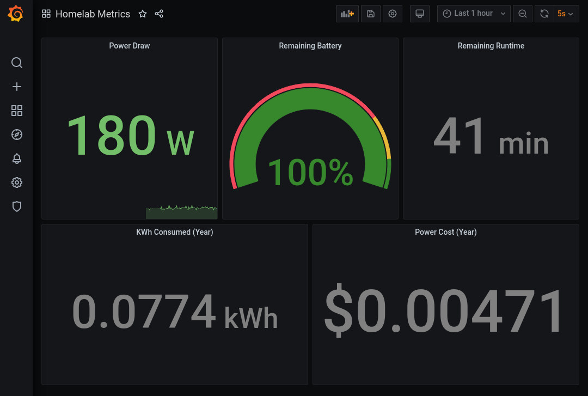

# homelab-metrics

A simple Prometheus + Grafana stack with a custom [nut exporter](https://github.com/mingcaozhang/nut-exporter).



## Install

```bash
git clone https://github.com/mingcaozhang/homelab-metrics.git 
cd homelab-metrics 
# Change the UPS_NAME, UPSD_HOST, UPSD_PORT env vars in docker-compose.yml to the correct ones
docker-compose up -d
```

If you don't have `nut-server` running and would like an all-in-one solution, you can use the version in the `pwrstat`
branch. That version makes use of a `pwrstat` wrapper and launches the `pwrstatd` daemon as well. You will need to do
USB pass-through to the docker container.
